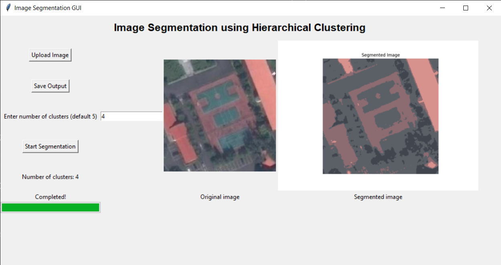

# Segmentation-using-Hierarchical-clustering

The provided code implements the Agglomerative Clustering algorithm, a hierarchical clustering technique that starts with each data point as a separate cluster and merges the closest clusters iteratively until reaching the desired number of clusters (k).

The executable file cann be accessed here [GNR_26](https://drive.google.com/drive/folders/1xMu_keilJ_-_lbM9L8ocW968rWKAdIak?usp=sharing)

## Algorithm Steps
1. **Initialization (__init__)**:
  - k: The target number of clusters.
  - initial_k: The initial number of clusters before merging.
2. **Initial Clustering (initial_clusters)**:
  - Partitions points into initial_k groups based on color similarity using the Euclidean distance metric.
  - Creates an initial dictionary of groups, each represented by a color value and containing associated points.
3. **Fit (fit)**:
  - Initializes clusters by calling initial_clusters.
  - Merges clusters iteratively until reaching k.
    - Finds the closest pair of clusters based on a custom distance function.
    - Removes the two closest clusters and merges them into a single cluster.
    - Adds the merged cluster back to the clusters list.
4. **Prediction (predict_cluster, predict_center)**:
  - predict_cluster: Determines the cluster number of a given point based on the clusters computed during the fit process.
  - predict_center: Finds the center of the cluster to which a point belongs, using the computed cluster centers.

## File List
1. `GNR_26.exe` : The executable to implement the program, can be accessed here [GNR_26](https://drive.google.com/drive/folders/1xMu_keilJ_-_lbM9L8ocW968rWKAdIak?usp=sharing)
2. `GNR_26.py` : Python code for GUI and execution of the algorithm
3. `src/model.py` : Contains the Hierarchical clustering model
4. `src/utils.py` : Essential functions for implementing the model
5. `images/raw` : Contains un-processed raw image
6.  `images/segmented` : Contains segmented images of the above raw images

## Executing the Programe

Shown above is the GUI for the programe. Select the image and output location using the buttons. Enter the number of clusters for which the algorithm has to be implemented, (default = 5). Once the parameters and input-output locations have been specified, start the segmentation. The result and input image will be shown as above. 

*Note: Segmentation of the image roughly takes 8-10 minutes on a standard i5-16GB configuration*
   
